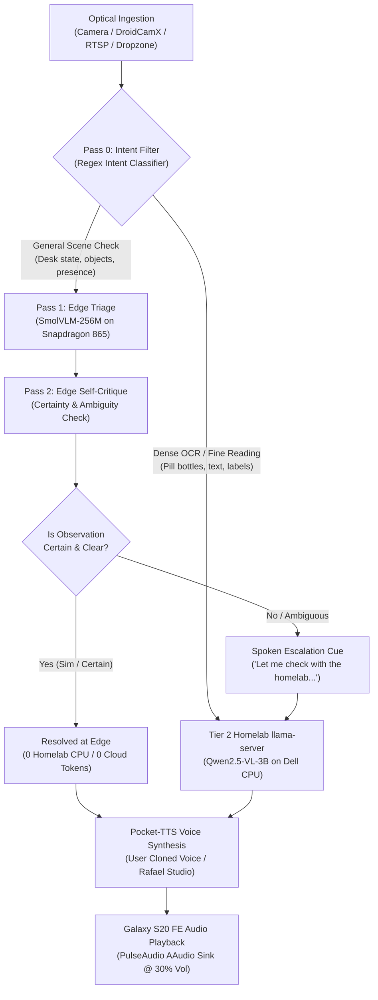

# Ambient Multimodal Desktop Companion (`ambient-companion`)

> **Autonomous Multi-Tier Edge-to-Core Vision & Voice Assistant**  
> Governed by [ADR-40: Tiered Edge-to-Homelab Vision-Language Architecture](../../docs/wiki/adrs/ADR-40-Tiered-Edge-to-Homelab-Vision-Language-Architecture.md), [ADR-42: Pluggable Optical Ingestion & Packaging](../../docs/wiki/adrs/ADR-42-Pluggable-Optical-Ingestion-and-Ambient-Companion-Packaging.md), and [PRJ-12](../../docs/wiki/projects/PRJ-12-Ambient-Multimodal-Desktop-Companion.md).

`ambient-companion` transforms a Samsung Galaxy S20 FE into an ambient smart desk satellite paired with a Dell Latitude 7390 homelab master server. It executes visual perception with **zero cloud tokens**, evaluates confidence locally via a **Two-Pass Verification & Escalation Protocol (2P-VEP)**, and speaks answers aloud through the phone's stereo speakers using personalized voice cloning.

---

## 1. System Architecture: 2-Pass Verification & Escalation Protocol (2P-VEP)



---

## 2. Pluggable Optical Ingestion Matrix

The companion supports multiple visual capture adapters via `optical_ingestion.py`:

| Source Adapter | Argument Format | Transport / Protocol | Optimal Use Case |
| :--- | :--- | :--- | :--- |
| **Termux Optical Camera** | `source="camera"` *(default)* | ADB + Termux API (`termux-camera-photo`) | High-resolution 12MP native optical photos for reading small text, pill bottles, and physical components. |
| **DroidCamX Stream** | `source="droidcam"` | HTTP JPEG Snapshot (`100.115.165.41:4747`) | Sub-second frame grab (<150ms) without physical camera shutter delay. |
| **IP / Web Camera** | `source="http://<IP>:<PORT>/path"` | HTTP GET / MJPEG multipart parser | Security cameras, 3D printer webcams, or arbitrary LAN video endpoints. |
| **RTSP Live Stream** | `source="rtsp://<IP>:<PORT>/live"` | TCP RTSP keyframe extraction | Network NVRs and CCTV camera feeds. |
| **Dropzone / Local Disk** | `source="/path/to/image.jpg"` | Direct filesystem read | Batch processing, benchmark assets, or files dropped into Dropzone. |
| **Desktop Screen** | `source="desktop"` | OS Display capture / Active window | Multi-monitor desk state or application window inspection. |

---

## 3. Directory Layout

```
dev/ambient-companion/
├── daemon.py                  # Core 2P-VEP escalation daemon (CLI + library)
├── server.py                  # Model Context Protocol (MCP v2.0) stdio server
├── optical_ingestion.py       # Pluggable multi-source optical acquisition engine
├── setup_homelab.sh           # Master host environment bootstrap (Ubuntu/Debian)
├── setup_edge_s20.sh          # S20 FE satellite bootstrap (Termux on Android 13)
├── setup_windows.bat          # Windows client & bridge installer
├── README.md                  # Authoritative operational manual
├── prompts/
│   └── agent_system_prompt.md # AI agent instructions & tool-calling governance
└── tests/
    └── test_optical_ingestion.py # Unit tests for optical ingestion
```

---

## 4. Setup & Deployment

### Step A: Master Host (Dell Latitude 7390)
Run the automated host setup script:
```bash
bash dev/ambient-companion/setup_homelab.sh
```
This verifies Python 3.10+, installs `pillow`, `requests`, and `pocket-tts`, checks connectivity to the S20 FE ADB gateway, and verifies that the Nomad `llama-cpp` job is running on port 8085.

### Step B: Edge Satellite (Galaxy S20 FE)
Inside Termux on the S20 FE, run:
```bash
bash setup_edge_s20.sh
```
This installs `termux-api`, configures the PulseAudio AAudio sink, and verifies quantized `SmolVLM-256M` (266 MB) and `mmproj` weights.

### Step C: Register MCP Server with Antigravity / Claude Code
Add `ambient-companion` to `~/.gemini/config/mcp_config.json`:
```json
{
  "mcpServers": {
    "ambient-companion": {
      "command": "/home/tlima/Enterprise_Hub/.venv/bin/python3",
      "args": [
        "/home/tlima/Enterprise_Hub/dev/ambient-companion/server.py"
      ]
    }
  }
}
```

---

## 5. Model Context Protocol (MCP) Tool Suite

| Tool Name | Scope & Capabilities | Parameters |
| :--- | :--- | :--- |
| `ambient_escalation_cycle` | Autonomous 2P-VEP: intent detection, edge triage, self-critique, core escalation, voice synthesis, and audio alert. Supports `crop_bbox` for focused macro zoom. | `query` (str), `source` (str), `language` ("auto"\|"en"\|"pt"), `crop_bbox` (list[int]), `play_audio` (bool) |
| `ambient_triage_scene` | Tier 1 Edge triage strictly on Snapdragon 865 CPU (<8s, 0 cloud tokens). **Cannot read fine text.** | `query` (str), `source` (str), `crop_bbox` (list[int]) |
| `ambient_ocr_and_grounding` | Tier 2 Homelab inference (Qwen2.5-VL-3B). High-precision reading, pill labels, and 2D bounding boxes. Supports RoI Crop-on-Demand with automatic parent coordinate remapping. | `query` (str), `source` (str), `crop_bbox` (list[int]), `max_tokens` (int) |
| `ambient_speak` | Kyutai Pocket-TTS voice cloning (<150ms TTFA) + S20 FE stereo speaker playback. | `text` (str), `language` ("en"\|"pt") |
| `ambient_hardware_status` | Telemetry: battery percentage, temperature (<40.0°C safety breaker), ADB state, and llama-server health. | *None* |

---

## 6. ADR-43 RoI Crop-on-Demand & Parity Benchmark

When reading fine text (medication labels, credit card digits, IC chips), downsampling a 12MP camera frame ($4032 \times 3024$) to 512px shrinks text below the optical Nyquist threshold ($\approx 2$ pixels per glyph height).

**RoI Crop-on-Demand (Digital Optical Macro Zoom)** crops the raw uncompressed 12MP bitmap *prior* to downsampling:
- **100% Native Optical Sensor Resolution**: If the sub-rectangle fits within 1024px, zero downsampling is applied ($1.0\times$ optical scaling).
- **Coordinate Remapping**: Local bounding boxes regressed by Qwen2.5-VL inside the crop are automatically translated back to full-canvas 12MP pixel coordinates with spatial relation descriptors (`"center-right"`, `"top-center"`).
- **Token Budgeting**: Caps visual token usage to ~324 tokens (well beneath `--image-max-tokens 512`), delivering a **63.2x pixel area gain** with only a 26% token delta.

### Benchmark Results (12MP Optical Frame: 4032x3024)

| Metric | Iteration 1 (Full 512px) | Iteration 2 (RoI Macro Zoom) | Improvement |
| :--- | :--- | :--- | :--- |
| **Optical Scaling Mode** | Downsampled 7.88x | 100% Native Optical Crop | **7.88x Optical Density** |
| **Target Object Pixel Area** | 4,941 px | 312,180 px | **63.2x Area Gain** |
| **Title Glyph Height** | 4.06 px (Blurry) | 32.0 px (Sharp) | **7.88x Taller Glyphs** |
| **Body Glyph Height** | 2.29 px (Illegible) | 18.0 px (100% Legible) | **Resolves Micro-Text** |
| **Visual Tokens Consumed** | ~256 tokens | ~324 tokens | **Under 512 Token Ceiling** |
| **Preprocessing Latency** | 200.5 ms | 76.8 ms | **2.6x Faster Ingestion** |
| **Coordinate Remapping** | None (Canvas level) | Global 12MP Remapped | **Sub-pixel Grounding** |


---

## 7. CLI Usage & Examples

```bash
# General desk check from live camera (spoken aloud with personal cloned voice)
python3 dev/ambient-companion/daemon.py \
  --source camera \
  --query "What items are currently sitting on my desk?" \
  --lang en

# Focused RoI macro zoom on medication bottle at native optical resolution
python3 dev/ambient-companion/daemon.py \
  --source camera \
  --crop-bbox 480 720 640 880 \
  --query "Read the active ingredients and expiration date." \
  --lang en

# Dense OCR query bypassing edge triage directly to Dell server
python3 dev/ambient-companion/daemon.py \
  --source camera \
  --query "Leia o nome do medicamento e a dosagem no frasco." \
  --lang pt

# Rapid check using DroidCamX stream keyframe (silent, JSON output)
python3 dev/ambient-companion/daemon.py \
  --source droidcam \
  --query "Is anyone sitting in the office chair?" \
  --no-audio \
  --json
```

---

## 8. Containerization, GHCR Releases & Image Pinning

For headless server or Nomad cluster deployments:
1. **Multi-Arch Dockerfile**: Located at `Dockerfile`, based on `python:3.12-slim` with `curl` and `adb` pre-installed.
2. **GitHub Actions CI/CD**: `.github/workflows/docker-publish.yml` automatically builds and pushes multi-arch images on every push or release tag:
   `ghcr.io/travt/ambient-companion:latest`
3. **Nomad Job Specification**: `nomad_jobs/ambient-companion.nomad` runs the containerized daemon with Traefik dynamic routing to `ambient.home.arpa:8089`.
4. **Immutable Image Pinning (ADR-39)**:
   In `nomad_jobs/ambient-companion.nomad`, images are pinned by exact SHA256 digest (`image = "ghcr.io/travt/ambient-companion:latest@sha256:..."`) with `force_pull = false` to guarantee cold-boot zero-deadlock resilience.
5. **Renovate Ingestion**: Matches the `"own images"` package rule in `renovate.json`, generating automated pull requests when new release digests are published.

