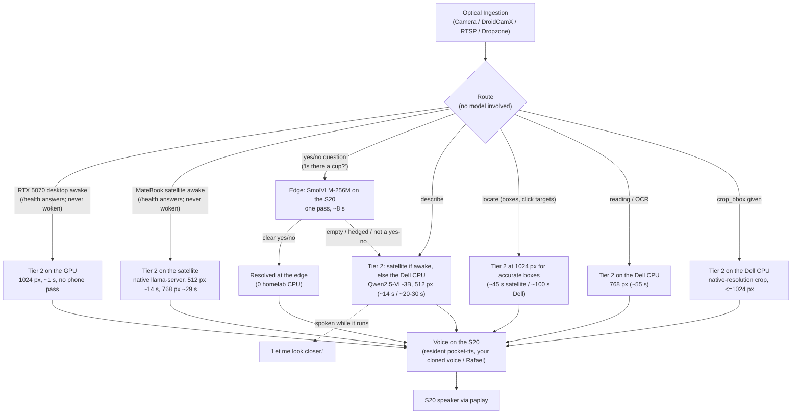

# Ambient Multimodal Desktop Companion (`ambient-companion`)

> **Autonomous Multi-Tier Edge-to-Core Vision & Voice Assistant**  
> Governed by [ADR-40: Tiered Edge-to-Homelab Vision-Language Architecture](../../docs/wiki/adrs/ADR-40-Tiered-Edge-to-Homelab-Vision-Language-Architecture.md), [ADR-42: Pluggable Optical Ingestion & Packaging](../../docs/wiki/adrs/ADR-42-Pluggable-Optical-Ingestion-and-Ambient-Companion-Packaging.md), and [PRJ-12](../../docs/wiki/projects/PRJ-12-Ambient-Multimodal-Desktop-Companion.md).

`ambient-companion` transforms a Samsung Galaxy S20 FE into an ambient smart desk satellite paired with a Dell Latitude 7390 homelab master server. It executes visual perception with **zero cloud tokens**, evaluates confidence locally via a **Two-Pass Verification & Escalation Protocol (2P-VEP)**, and speaks answers aloud through the phone's stereo speakers using personalized voice cloning.

---

## 1. System Architecture: availability-first routing (v1.4)

The tier is chosen by hardware that is awake and by the shape of the question, not by asking the small model to grade itself (the old 2P-VEP self-critique cost ~7 s and often escalated anyway). Measured 2026-10-07: Tier 2 time is almost linear in visual tokens (~10 tokens/s prefill on the Dell CPU): 512 px = 303 tokens = 31 s, 1024 px = ~1044 tokens = 103 s.



---

## 2. Pluggable Optical Ingestion Matrix

The companion supports multiple visual capture adapters via `optical_ingestion.py`:

| Source Adapter | Argument Format | Transport / Protocol | Optimal Use Case |
| :--- | :--- | :--- | :--- |
| **Termux Optical Camera** | `source="camera"` *(default)* | ADB + Termux API (`termux-camera-photo`) | High-resolution 12MP native optical photos for reading small text, pill bottles, and physical components. |
| **DroidCamX Stream** | `source="droidcam"` | HTTP JPEG Snapshot (`100.115.165.41:4747`) | Sub-second frame grab (<150ms) without physical camera shutter delay. |
| **IP / Web Camera** | `source="http://<IP>:<PORT>/path"` | HTTP GET / MJPEG multipart parser | Security cameras, 3D printer webcams, or arbitrary LAN video endpoints. |
| **RTSP Live Stream** | `source="rtsp://<IP>:<PORT>/live"` | TCP RTSP keyframe extraction | Network NVRs and CCTV camera feeds. |
| **Dropzone / Local Disk** | `source="/path/to/image.jpg"` | Direct filesystem read | Batch processing, benchmark assets, or files dropped into Dropzone. |
| **Desktop Screen** | `source="desktop"` | OS Display capture / Active window | Multi-monitor desk state or application window inspection. |

---

## 3. Directory Layout

```
dev/ambient-companion/
├── daemon.py                  # Core 2P-VEP escalation daemon (CLI + library)
├── server.py                  # MCP tools: `serve` = the HTTP service (production); no args = stdio dev mode
├── mcp_proxy.py               # stdio -> service proxy that Antigravity / Claude Code register
├── http_service.py            # HTTP front-end: /health, /ready, POST /mcp (bearer token)
├── optical_ingestion.py       # Pluggable multi-source optical acquisition engine
├── config.py                  # Environment-driven settings (no host paths in code)
├── housekeeping.py            # Retention for frames/WAVs (host cache + S20 Download)
├── Dockerfile                 # Non-root slim image (HTTP + MCP service)
├── requirements.txt           # Core deps (pillow, requests)
├── requirements-tts.txt       # Optional pocket-tts (multi-GB, not in the image)
├── setup_homelab.sh           # Dell preflight + GitOps deploy hint (--dev for a host venv)
├── setup_edge_s20.sh          # S20 FE satellite bootstrap (Termux), checksum-verified models
├── setup_windows.bat          # Windows client installer (private venv + service check)
├── README.md                  # Authoritative operational manual
├── prompts/
│   └── agent_system_prompt.md # AI agent instructions & tool-calling governance
└── tests/                     # Hardware-free unit tests (run in CI before the image build)
```

### Where each part runs

| Target | Runs | How it is installed |
| :--- | :--- | :--- |
| **Dell (homelab)** | The containerized service (HTTP + MCP, ADB client, calls Tier 2 llama-server) | Nomad job via Ansible `--tags docker` |
| **S20 FE** | Camera, SmolVLM triage, voice synthesis (pocket-tts) and speaker (native Termux) | `setup_edge_s20.sh` |
| **Windows / other desktops** | Client only | `setup_windows.bat` |

---

## 4. Setup & Deployment

### Step A: Master Host (Dell Latitude 7390), containerized service
Run the read-only preflight (safe to repeat, changes nothing):
```bash
bash dev/ambient-companion/setup_homelab.sh
```
It checks `docker`/`nomad`/`adb`, the ADB gateway on `127.0.0.1:5037`, the Tier 2 llama-server and the voice profile, then prints the deploy command. Deployment is GitOps only:
```bash
ansible-playbook -i ansible/inventory.ini ansible/site.yml --tags docker --vault-password-file ansible/.vault_pass
```
The bearer token (`AMBIENT_API_TOKEN`) comes from the vault at deploy time (`python3 scripts/get_secret.py`); nothing secret is stored in this repo. For a host-native CLI instead of the container: `bash setup_homelab.sh --dev` (add `--with-tts` for pocket-tts).

### Step B: Edge Satellite (Galaxy S20 FE)
Inside Termux on the S20 FE, run (re-runnable; models are verified against Hugging Face's SHA-256):
```bash
bash setup_edge_s20.sh
```

### Step C: Register the MCP server (one companion for the whole lab)
There is **one** companion: the Nomad service on the Dell (`ambient.home.arpa`). It decides whether to escalate to the RTX 5070 desktop or the satellite (when awake) or to answer with the Dell's own 3B, and it owns the camera lock, the voice and the state. Clients never start their own copy:

* **stdio clients (Antigravity, Claude Code)** register `mcp_proxy.py`, which forwards each JSON-RPC line to the service and reads the bearer token from the vault at start (nothing secret in the config):
```json
{
  "mcpServers": {
    "ambient-companion": {
      "command": "/home/tlima/Enterprise_Hub/.venv/bin/python3",
      "args": ["/home/tlima/Enterprise_Hub/dev/ambient-companion/mcp_proxy.py"]
    }
  }
}
```
  Claude Code: `claude mcp add -s user ambient-companion -- /home/tlima/Enterprise_Hub/.venv/bin/python3 /home/tlima/Enterprise_Hub/dev/ambient-companion/mcp_proxy.py`. On another machine set `AMBIENT_MCP_URL=http://ambient.home.arpa/mcp` and `AMBIENT_API_TOKEN`.
* **HTTP clients** call `POST http://ambient.home.arpa/mcp` with `Authorization: Bearer $AMBIENT_API_TOKEN` (one JSON-RPC 2.0 request per call). Open WebUI goes through `scripts/homelab_mcp_server.py`, whose ambient tools forward to the same service.
* `python3 server.py` (stdio, no arguments) is a **development mode only**: it starts a private copy whose camera lock is not shared with the service. Do not register it in a client.

`desktop-vlm-lens` (PRJ-13) is a different thing: a standalone stdio server for one machine (the office laptop), with no homelab addresses in its defaults.

---

### Step D: Windows client
Run `setup_windows.bat` (creates a private venv, checks `http://ambient.home.arpa/health`). Set `AMBIENT_API_TOKEN` in your user environment.

### Configuration (environment)
| Variable | Default | Purpose |
| :--- | :--- | :--- |
| `ADB_GATEWAY_HOST` | `127.0.0.1` | ADB server of `custom-ws-scrcpy` (host loopback `:5037`) |
| `S20_DEVICE_TARGET` | `100.115.165.41:5555` | Edge device serial |
| `EDGE_TERMUX_UID` | `u0_a356` | Termux app uid on the S20 |
| `LLAMA_SERVER_URL` / `FALLBACK_LLAMA_SERVER_URL` | `127.0.0.1:8085` / GPU desktop | Tier 2 endpoints |
| `VLM_MODEL` | `qwen2.5vl:3b` | Model alias sent to llama-server |
| `AMBIENT_DATA_DIR` | `/home/tlima/Enterprise_Hub/data` | Data root (`/data` in the container) |
| `AMBIENT_ALLOWED_DIRS` | unset (unrestricted) | Colon list the `file` source may read (set in the container) |
| `AMBIENT_HOST` / `AMBIENT_PORT` | `127.0.0.1` / `8089` | HTTP listener |
| `AMBIENT_API_TOKEN` | empty (auth off) | Bearer token for `POST /mcp` |
| `SATELLITE_LLAMA_SERVER_URL` | `http://100.105.6.62:8090/v1/chat/completions` | MateBook satellite llama-server (`satellite_vlm` Ansible role, tailnet only, about 2x the Dell). Probed with `/health`, never woken; `""` disables |
| `FALLBACK_LLAMA_SERVER_URLS` | Omarchy `http://100.102.231.37:8085/...`, then Windows `http://100.77.169.15:8085/...` | The RTX 5070 desktop is one dual-boot rig with two tailnet identities; the first URL whose `/health` answers is used (only one OS side is online at a time). A single `FALLBACK_LLAMA_SERVER_URL` still works |
| `AMBIENT_PREFER_GPU` / `AMBIENT_GPU_PROBE_TTL` | `1` / `15` | Use the RTX 5070 desktop first when its `/health` answers (probed, never woken); probe cache in seconds |
| `AMBIENT_SCENE_PX` / `AMBIENT_READ_PX` / `AMBIENT_GROUND_PX` | `512` / `768` / `1024` | Longest side sent to Tier 2 for scenes, for reading and for locate questions (crops go up to 1024; the GPU always gets 1024). Locate needs 1024: click error was 7-60 px at 512, 10-173 px at 768 and 0-6 px at 1024 |
| `AMBIENT_LAST_FRAME_TTL` / `AMBIENT_SPEAK_MAX_WORDS` | `60` / `28` | How long `reuse_last_frame` may re-use the previous frame, and how many words of an answer are spoken (the full answer is always returned as text) |
| `AMBIENT_RETENTION_DAYS` | `7` | Age after which cached frames/WAVs are deleted |
| `AMBIENT_TTS_MODE` | `edge` | `edge`: pocket-tts runs on the S20 FE (Termux) and plays via `paplay`; `host`: synthesize locally with `POCKET_TTS_BIN` and push the WAV (dev CLI); `off`: never speak |
| `EDGE_TTS_BIN` / `EDGE_VOICE_EN` / `EDGE_VOICE_PT` | `pocket-tts` / `~/voices/voice_profile_user_optionB_full25s.safetensors` / `rafael` | Voice backend and profiles inside Termux |
| `AMBIENT_TTS_WARM` / `EDGE_TTS_PORT` | `1` / `8765` | Keep `pocket-tts serve` resident on the phone (about 0.9 GB RAM, started on demand by the companion). Short phrases take ~2 s instead of ~8 s; `0` uses the per-call CLI |
| `POCKET_TTS_BIN` | `pocket-tts` on `PATH` | Host mode only (absent in the container) |

---

## 5. Model Context Protocol (MCP) Tool Suite

| Tool Name | Scope & Capabilities | Parameters |
| :--- | :--- | :--- |
| `ambient_escalation_cycle` | Routed answer (GPU when awake, else by question shape), spoken cue while the Dell works, and the answer spoken on the phone. Supports `crop_bbox` for focused macro zoom. | `query` (str), `source` (str), `language` ("auto"\|"en"\|"pt"), `crop_bbox` (list[int]), `play_audio` (bool) |
| `ambient_triage_scene` | Tier 1 Edge triage strictly on Snapdragon 865 CPU (<8s, 0 cloud tokens). **Cannot read fine text.** | `query` (str), `source` (str), `crop_bbox` (list[int]) |
| `ambient_ocr_and_grounding` | Tier 2 Homelab inference (Qwen2.5-VL-3B). High-precision reading, pill labels, and 2D bounding boxes. Supports RoI Crop-on-Demand with automatic parent coordinate remapping. Returns `click_x` / `click_y` pixel targets for locate questions. | `query` (str), `source` (str), `crop_bbox` (list[int]), `max_tokens` (int) |
| `ambient_speak` | Kyutai Pocket-TTS voice cloning (<150ms TTFA) + S20 FE stereo speaker playback. | `text` (str), `language` ("en"\|"pt") |
| `ambient_hardware_status` | Telemetry: battery percentage, temperature (<40.0°C safety breaker), ADB state, and llama-server health. | *None* |

---

## 6. ADR-43 RoI Crop-on-Demand & Parity Benchmark

When reading fine text (medication labels, credit card digits, IC chips), downsampling a 12MP camera frame ($4032 \times 3024$) to 512px shrinks text below the optical Nyquist threshold ($\approx 2$ pixels per glyph height).

**RoI Crop-on-Demand (Digital Optical Macro Zoom)** crops the raw uncompressed 12MP bitmap *prior* to downsampling:
- **100% Native Optical Sensor Resolution**: If the sub-rectangle fits within 1024px, zero downsampling is applied ($1.0\times$ optical scaling).
- **Coordinate Remapping**: Local bounding boxes regressed by Qwen2.5-VL inside the crop are automatically translated back to full-canvas 12MP pixel coordinates with spatial relation descriptors (`"center-right"`, `"top-center"`).
- **Token Budgeting**: Caps visual token usage to ~324 tokens (well beneath `--image-max-tokens 512`), delivering a **63.2x pixel area gain** with only a 26% token delta.

### Benchmark Results (12MP Optical Frame: 4032x3024)

| Metric | Iteration 1 (Full 512px) | Iteration 2 (RoI Macro Zoom) | Improvement |
| :--- | :--- | :--- | :--- |
| **Optical Scaling Mode** | Downsampled 7.88x | 100% Native Optical Crop | **7.88x Optical Density** |
| **Target Object Pixel Area** | 4,941 px | 312,180 px | **63.2x Area Gain** |
| **Title Glyph Height** | 4.06 px (Blurry) | 32.0 px (Sharp) | **7.88x Taller Glyphs** |
| **Body Glyph Height** | 2.29 px (Illegible) | 18.0 px (100% Legible) | **Resolves Micro-Text** |
| **Visual Tokens Consumed** | ~256 tokens | ~324 tokens | **Under 512 Token Ceiling** |
| **Preprocessing Latency** | 200.5 ms | 76.8 ms | **2.6x Faster Ingestion** |
| **Coordinate Remapping** | None (Canvas level) | Global 12MP Remapped | **Sub-pixel Grounding** |


---

### Follow-ups and speech (v1.6.0)
* **Follow-ups on the same scene:** the Tier 2 request puts the image before the text, so llama-server keeps the image tokens when only the question changes. Pass `reuse_last_frame: true` (cycle, triage and grounding tools) to skip the capture too. Measured on the satellite: different questions on one frame 13-15 s with the text first, 0.6-2 s with the image first; end to end a follow-up took 1.1 s. A yes/no follow-up skips the phone's SmolVLM and goes to Tier 2, where the image is cached.
* **The "let me look closer" cue** is spoken only if Tier 2 has not answered after 3 s (`AMBIENT_CUE_DELAY`), so a fast or cached answer never waits for it.
* **Where the time goes:** every cycle returns `phase_sec` (thermal, acquire, prepare, tier2, speech, final_temp). On the satellite a 7-word spoken follow-up is ~0.5 s Tier 2 and ~6 s speech: the phone synthesizes at roughly 2 words per second, so speech is the limit now.
* **Speech:** the first sentence (or about 28 words) is spoken, in chunks that are synthesized while the previous chunk plays, so audio starts after about 4 s instead of ~10 s.
* **Playback is judged by `paplay`'s exit code**, and the companion restarts a hung PulseAudio on the phone (alive but refusing connections: hard kill, remove the stale pid file, start the AAudio sink) before speaking. `/ready` reports `audio`.

### Grounding coordinate format (fixed in v1.4.1)

Qwen2.5-VL answers boxes as **absolute pixels `[x1, y1, x2, y2]` in the image it saw**, after llama.cpp resizes it to multiples of 28 (and up to the `--image-min-tokens` floor, `VLM_IMAGE_MIN_TOKENS`, default 256). Before 1.4.1 the parser read them as normalized 0-1000 `[ymin, xmin, ymax, xmax]`, so boxes were hundreds of pixels off (measured on a mock login page with known positions: 208 to 395 px; after the fix 2 to 10 px at 512 px). `optical_ingestion.qwen_input_size()` reproduces the resize (verified against 297 / 598 / 1030 measured prompt tokens) and `parse_grounding_coordinates(..., model_size=...)` converts. Results now include `click_x`, `click_y` and `box_xyxy_pixels` on the original canvas (the older `center_pixels` stays `[y, x]`). Locate questions ask for "only the bounding box as [x1, y1, x2, y2]", with one stricter retry if the model answers in prose.

---

## 7. CLI Usage & Examples

```bash
# General desk check from live camera (spoken aloud with personal cloned voice)
python3 dev/ambient-companion/daemon.py \
  --source camera \
  --query "What items are currently sitting on my desk?" \
  --lang en

# Focused RoI macro zoom on medication bottle at native optical resolution
python3 dev/ambient-companion/daemon.py \
  --source camera \
  --crop-bbox 480 720 640 880 \
  --query "Read the active ingredients and expiration date." \
  --lang en

# Dense OCR query bypassing edge triage directly to Dell server
python3 dev/ambient-companion/daemon.py \
  --source camera \
  --query "Leia o nome do medicamento e a dosagem no frasco." \
  --lang pt

# Rapid check using DroidCamX stream keyframe (silent, JSON output)
python3 dev/ambient-companion/daemon.py \
  --source droidcam \
  --query "Is anyone sitting in the office chair?" \
  --no-audio \
  --json
```

---

## 8. Containerization, GHCR Releases & Image Pinning

1. **Image**: `Dockerfile` builds a slim, non-root (`uid 1000`) service on `python:3.12-slim` with `adb` and `ffmpeg`. No `raw_exec` or privileges are needed. Voice synthesis is not baked in (`--build-arg WITH_TTS=1` adds pocket-tts and needs far more memory).
2. **CI**: `.github/workflows/docker-publish.yml` runs the unit tests, then builds and pushes `ghcr.io/travt/ambient-companion` tagged `sha-<short>` on every main build and `X.Y.Z` (no `v`) on release tags (plus the moving `latest`/`main` tags, which the cluster never pins).
3. **Nomad job**: `nomad_jobs/ambient-companion.nomad` in the cluster repo runs it with an HTTP `/health` check, a Traefik route and a Tailscale-safe loopback bind.
4. **Pinning (ADR-47)**: the job pins `ghcr.io/travt/ambient-companion:<version tag>@sha256:<digest>`. Read the digest from the registry (`docker buildx imagetools inspect ghcr.io/travt/ambient-companion:<tag>`), never type it. Renovate (`"own images"` rule) bumps tag and digest together.
